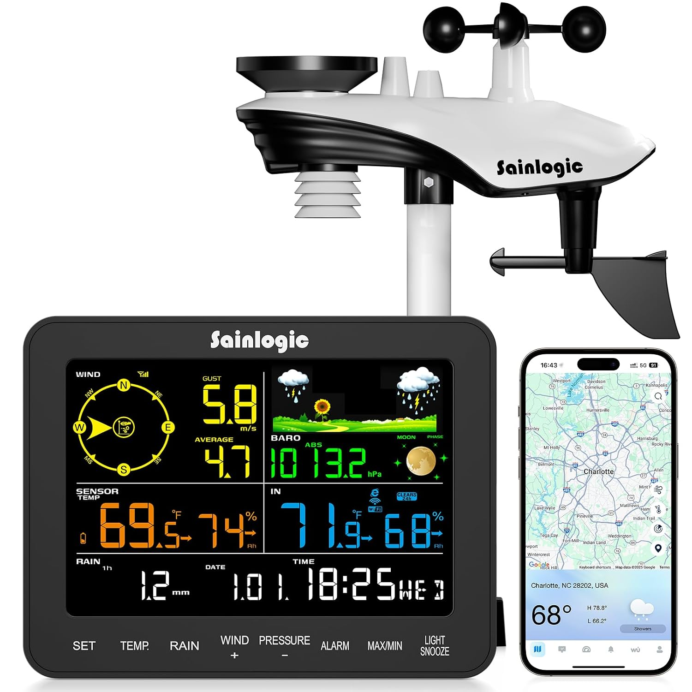
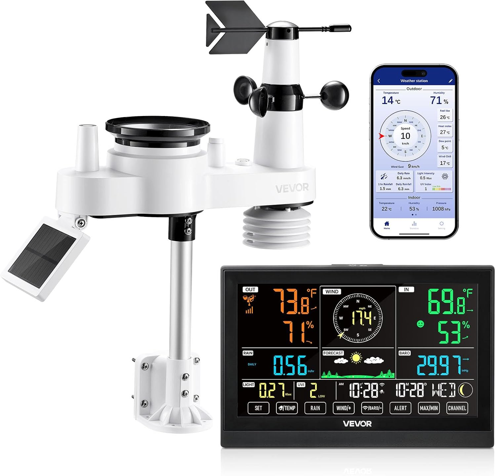
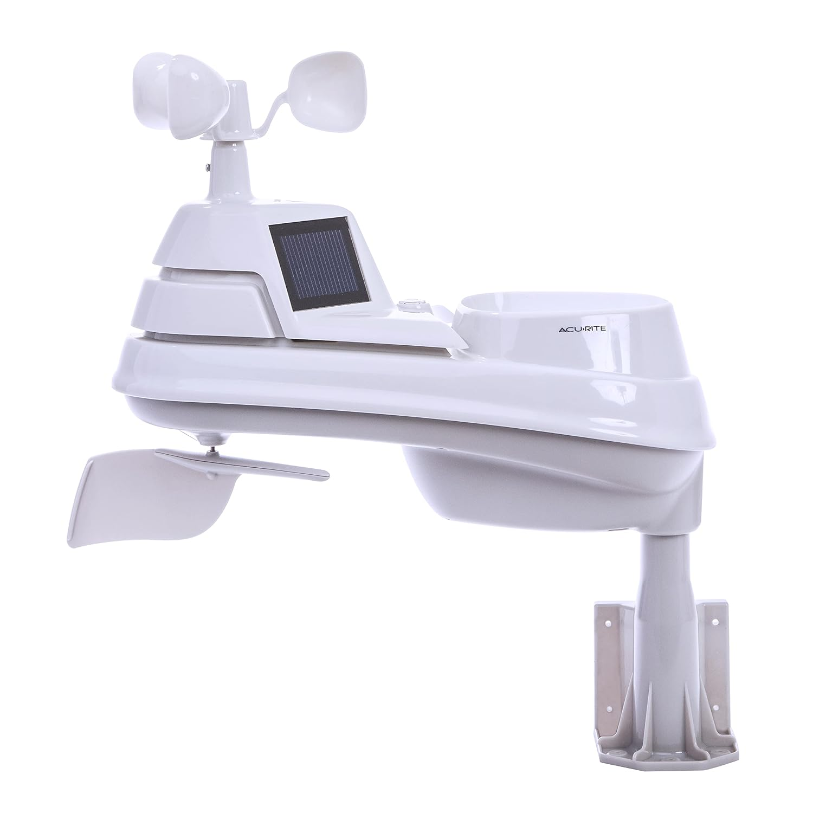

## Voice of the Customer Benchmarking Example

### Search #1

**Keywords:** "wireless outdoor weather station solar uv wind speed"

**Search Results Link:** [https://www.amazon.com/s?k=wireless+outdoor+weather+station+solar+uv+wind+speed](https://www.amazon.com/s?k=wireless+outdoor+weather+station+solar+uv+wind+speed)

### Selected Products

#### 1. [Ambient Weather WS-2000 WiFi Smart Weather Station](https://www.amazon.com/gp/aw/d/B07GRBY9NP)

* Price: $299.99
* Vendor: Amazon
* Description: All-in-one wireless outdoor sensor array measuring wind speed, wind direction, temperature, humidity, UV index, solar radiation, and rainfall, transmitting data to an indoor color LCD console.

##### Positive Comments

| Voice of the Customer | Restated Customer Need |
| :--- | :--- |
| "This is my second Ambient PWS. I received this as a Christmas gift. Easy to run through the instructions but the user should use the video based tutorial rather than the printed instructions. Accuracy seems perfect but I had to spend a bit of time calibrating the baramoter. I would recommend this model for any weather enthusiast." | 1. The device includes step-by-step setup documentation. (Explicit) 2. Setup materials utilize visual media to guide assembly and configuration. (Latent) 3. The system allows manual calibration offset adjustments for barometric pressure. (Explicit) |

##### Negative Comments

| Voice of the Customer | Restated Customer Need |
| :--- | :--- |
| "Product works fine, but do know it uses frequency 868 MHz, while all its accessories are on 915 MHz and are thus not usable. Better go for an Ecowitt Weather station." | 1. Wireless subsystems operate across matching regional frequency bands. (Explicit) 2. Main base stations maintain hardware compatibility with expansion accessories. (Explicit) 3. Wireless operating frequencies are clearly identified across system documentation and packaging. (Latent) |

---
#### 2. [4900FT WiFi Smart Weather Stations Wireless Indoor Outdoor, LoRa Based Wireless Weather Station with 7.4” HD Display, 7-in-1 Solar Sensor, Thermo-Hygro Sensor, Bird Spike](https://www.amazon.com/AIR-ALFA-Stations-Wireless-Thermo-Hygro/dp/B0GQZ68ZFC/)

* Price: $199.99
* Vendor: Amazon
* Description: An expandable outdoor environmental monitoring system featuring a 7-in-1 solar-powered sensor array and a 7.4-inch HD color display console. The outdoor unit tracks temperature, humidity, rainfall, wind speed, wind direction, UV, and light intensity, using long-range LoRa wireless technology to transmit telemetry up to 4,900 feet to the console. The system supports up to 14 multi-zone add-on sensors and offers 2.4 GHz Wi-Fi connectivity for mobile app alerting and CSV data export.

##### Positive Comments

| Voice of the Customer | Restated Customer Need |
| :--- | :--- |
| "Delivered quickly, set-up was a snap. Has great features and can add other sensors." | 1. The device requires minimal assembly and configuration to begin operating. (explicit) 2. The system allows users to connect auxiliary environmental sensors. (explicit)) 3. Out-of-box user onboarding is straightforward for non-technical users. (latent) |

##### Negative Comments

| Voice of the Customer | Restated Customer Need |
| :--- | :--- |
| "I had high hopes for this device, but unfortunately, it didn't hold up. Within a short period of use, the sensors began giving inconsistent readings, and it frequently lost connection with the base station. The overall build quality felt flimsy, and it ultimately didn't meet expectations. I wouldn't recommend this product." | 1. The sensors maintain consistent measurement accuracy over time. (explicit) 2. The wireless link maintains continuous connection with the base station. (explicit) 3. Internal components resist signal degradation and measurement drift during extended deployment. (latent) |

---

#### 3. [Sainlogic Smart WiFi Weather Station with Rain Gauge and Wind Speed, 24/7 AI Weather Forecast by Weatherseed®, Wireless Indoor Outdoor, APP Alerts, 2-Year Data Export](https://www.amazon.com/Sainlogic-Weather-Forecast-Weatherseed%C2%AE-Wireless/dp/B0GXFC21DP/))

* Price: $169.99
* Vendor: Amazon
* Description: A Wi-Fi-enabled weather monitoring station featuring an integrated outdoor sensor array, high-contrast display console, and mobile app integration. The system tracks temperature, humidity, barometric pressure, and rainfall (accurate to ±1 mm) with a wireless range covering residential and agricultural properties. The base unit syncs with a mobile app via 2.4 GHz Wi-Fi to deliver AI-driven weather forecasting, real-time threshold alerts, and a 2-year data archive with Excel export capabilities.

##### Positive Comments

| Voice of the Customer | Restated Customer Need |
| :--- | :--- |
| "Seems like a good product for the price paid, so far. I like the easy setup and the color display. I've noticed that the indoor temperature kind of changes in big increments, one degree or more. I wonder about the accuracy of the temp measurement. Also the outside sensor displays what it seems a higher humidity than it feels. Also the change is in big increments, 5-9%. Will see if these changes stabilize more in time." | 1. The product offers competitive features relative to its cost. (explicit) 2. The system allows quick, straightforward initial hardware setup. (explicit) 3. The display unit utilizes a clear, color-coded visual interface. (explicit) |

##### Negative Comments

| Voice of the Customer | Restated Customer Need |
| :--- | :--- |
| "Easy set up and decent display. The Weatherseed app leaves a bit to be desired, as does the info it provides to Weather Underground I had a station from a different manufacturer at our prior home that sent the info from the barometer to WU. This Sainlogic unit does not. Had I known the two item mentioned above I would not have purchased this unit" | 1. he mobile application provides a robust and feature-rich user interface. (explicit) 2. The system transmits all local sensor parameters (including barometric pressure) to third-party weather services. (explicit) 3. Product documentation explicitly lists data field limitations for third-party integrations prior to purchase. (latent) |

---
#### 4. [VEVOR 7-in-1 Wi-Fi Weather Station with APP, 7.5-Inch VA Display, Solar Powered Outdoor Sensor, Rain Gauge, Indoor Outdoor for Weather Forecast, Wind Speed, Temperature, Humidity, Rainfall]([https://www.amazon.com/Sainlogic-Weather-Forecast-Weatherseed%C2%AE-Wireless/dp/B0GXFC21DP/)](https://www.amazon.com/VEVOR-Wi-Fi-Weather-Station-Temperature/dp/B0FM3CVKNL/))

* Price: $100.99
* Vendor: Amazon
* Description:7-in-1 Outdoor Sensor: Monitor temperature, humidity, rainfall, wind speed, direction, sunlight, plus dew point, moon phases, and 6-12 hour forecasts
  
##### Positive Comments

| Voice of the Customer | Restated Customer Need |
| :--- | :--- |
| "The build quality is much better than I expected at this price range. Easy to set up and all the features work great. The app is also great and allows for remote access to the data on your phone. For the negative reviews about wind speed accuracy, I suspect people don’t realize or understand how wind speed is affected by nearby objects, roof, etc. Put some thought into where you mount the outdoor unit for best results." | 1. The structural housing utilizes durable materials that exceed standard price-tier expectations. (explicit) 2. The system allows straightforward hardware assembly and initial software pairing. (explicit) 3. Integrated subsystem features perform consistently across all operational modes. (latent) |

##### Negative Comments

| Voice of the Customer | Restated Customer Need |
| :--- | :--- |
| "Nice weather station and easy to set up. However I find the listing to be extremely misleading. The listing says "with app". But this really iant true. The weather station sends information to the smart life app. It is not a dedicated app for your station. I would not have bought this if I knew this in advance. I wanted a dedicated app with one click to access information. The worst issue is the temperature is in red on a black background which make us very hard to read. They need a software upgrade to get rid of the red readings, or a lighter background" | 1. Product marketing listings accurately reflect the exact software ecosystem and app architecture used. (explicit) 2. The display firmware allows user customization of color schemes and text contrast levels. (latent) 3. The display console employs high-contrast visual elements for dark background environments. (explicit) |

---

#### 5. [AcuRite Iris PRO+ (5-in-1) Weather Sensor](https://www.amazon.com/AcuRite-Weather-Direction-Temperature-Humidity/dp/B00SN1WHEU/)

* Price: $107.99
* Vendor: Amazon
* Description:A high-precision 5-in-1 outdoor weather sensor node that measures temperature (-40°C to 70°C), relative humidity, wind speed, wind direction, and rainfall. The outdoor array features dual solar panels powering an internal aspirating fan to maximize ambient temperature accuracy. Data is transmitted via a 433 MHz wireless link with a range of up to 330 ft (100 m) at 36-second intervals. Powered by 4 AA batteries, the sensor is compatible with AcuRite Access hub systems and standalone display consoles.
  
##### Positive Comments

| Voice of the Customer | Restated Customer Need |
| :--- | :--- |
| "I had to replace an old 5-in-1 that served me well for many years. This one is very accurate especially with humidity and pressure. My old one did not do real well with outside humidity and pressure. All the readings for this one are right on. When I calibrated the rain gauge before putting it up the gauge was right on as the manual stated the reading should be." | 1. Outdoor sensor arrays deliver high-accuracy telemetry for ambient relative humidity and barometric pressure. (explicit) 2. Product manuals provide clear, reliable instructions for verifying sensor calibration prior to installation. (explicit) 3. Modular mounting interfaces allow straightforward replacement of legacy sensor heads within the same ecosystem. (latent) |

##### Negative Comments

| Voice of the Customer | Restated Customer Need |
| :--- | :--- |
| "Don't waste your money on this cheap plastic crap. Initially, it worked pretty well (for less than a year), but it has been junk this summer, reporting hotter days than other weather stations, dramatically! Their support (Selene) is argumentative, will not listen, and claims that a 4-degree F difference is within their guidelines. Well, I am getting more than that on hot days over 90 degrees. Two other weather systems I have used to compare this AcuRite with are very accurate, and these two systems are within 1-2 degrees consistently on hot days. Their customer service (ha, ha) will not listen or agree that they have a defective unit, so little to no customer service. Pull up Five Best Weather Stations for 2026, and you will see AcuRite is #5: poorest accuracy, poorest wireless performance, build and durability are the poorest, and it goes on and on..... Poor quality, poor engineering, poor customer service, etc. Don't waste your money unless you want cheap and crappy quality and horrible accuracy. Spend a bit more and get what you pay for. This company needs to clean their management of dead wood!" | 1.Enclosures deploy effective thermal shielding and aspirating airflow to prevent direct solar radiation bias. (latent) 2. Sensor heads maintain measurement tolerance standards over multi-year outdoor deployments. (latent) 3. Product engineering practices ensure reliable long-term mechanical and electrical build quality. (explicit) |

---

## Organized Need Statements

### First Placement

### Grouped with categories

#### 1. Sensing & Thermal Accuracy
* The sensors maintain consistent measurement accuracy over time.
* Outdoor sensor arrays deliver high-accuracy telemetry for ambient relative humidity and barometric pressure.
* Enclosures deploy effective thermal shielding and aspirating airflow to prevent direct solar radiation bias.
* Sensor heads maintain measurement tolerance standards over multi-year outdoor deployments.
* The system allows manual calibration offset adjustments for barometric pressure.

#### 2. Wireless Communications & RF Architecture
* Wireless subsystems operate across matching regional frequency bands.
* The wireless link maintains continuous connection with the base station.
* Wireless operating frequencies are clearly identified across system documentation and packaging.
* Main base stations maintain hardware compatibility with expansion accessories.
* The system allows users to connect auxiliary environmental sensors.

#### 3. Display, UI & Human Factors
* The display unit utilizes a clear, color-coded visual interface.
* The display console employs high-contrast visual elements for dark background environments.
* The display firmware allows user customization of color schemes and text contrast levels.
* The device requires minimal assembly and configuration to begin operating.
* The device includes step-by-step setup documentation.
* Setup materials utilize visual media to guide assembly and configuration.
* Out-of-box user onboarding is straightforward for non-technical users.

#### 4. Software & Cloud Integration
* The mobile application provides a robust and feature-rich user interface.
* The system transmits all local sensor parameters (including barometric pressure) to third-party weather services.
* Product documentation explicitly lists data field limitations for third-party integrations prior to purchase.
* Product marketing listings accurately reflect the exact software ecosystem and app architecture used.

#### 5. Mechanical Enclosure & System Durability
* The structural housing utilizes durable materials that exceed standard price-tier expectations.
* Product engineering practices ensure reliable long-term mechanical and electrical build quality.
* Internal components resist signal degradation and measurement drift during extended deployment.
* Modular mounting interfaces allow straightforward replacement of legacy sensor heads within the same ecosystem.
* Product manuals provide clear, reliable instructions for verifying sensor calibration prior to installation.

### Ranked

#### Priority 1: High (Critical System Functionality)
1. The sensors maintain consistent measurement accuracy over time.
2. The wireless link maintains continuous connection with the base station.
3. Wireless subsystems operate across matching regional frequency bands.
4. Enclosures deploy effective thermal shielding and aspirating airflow to prevent direct solar radiation bias.
5. Product engineering practices ensure reliable long-term mechanical and electrical build quality.
6. The system transmits all local sensor parameters (including barometric pressure) to third-party weather services.

#### Priority 2: Medium (Usability & System Flexibility)
1. Main base stations maintain hardware compatibility with expansion accessories.
2. The system allows users to connect auxiliary environmental sensors.
3. The display console employs high-contrast visual elements for dark background environments.
4. The display firmware allows user customization of color schemes and text contrast levels.
5. The system allows manual calibration offset adjustments for barometric pressure.
6. The device requires minimal assembly and configuration to begin operating.
7. Sensor heads maintain measurement tolerance standards over multi-year outdoor deployments.

#### Priority 3: Low (Documentation & Secondary Features)
1. Setup materials utilize visual media to guide assembly and configuration.
2. Wireless operating frequencies are clearly identified across system documentation and packaging.
3. Product documentation explicitly lists data field limitations for third-party integrations prior to purchase.
4. Product marketing listings accurately reflect the exact software ecosystem and app architecture used.
5. Modular mounting interfaces allow straightforward replacement of legacy sensor heads within the same ecosystem.

---
## Compiled list of user Needs

| Need ID | Meta-Category | Restated User Need | Type | Importance |
| :--- | :--- | :--- | :--- | :--- |
| **N01** | Sensing | Outdoor array samples ambient temperature, humidity, wind speed, direction, rain, UV, and light intensity. | Explicit | High |
| **N02** | Sensing | Thermal enclosure deploys aspirating airflow shielding to prevent direct solar radiation heat distortion. | Latent | High |
| **N03** | Sensing | ADC sampling and firmware filtering eliminate coarse measurement quantization jumps. | Latent | High |
| **N04** | Sensing | Base station allows user manual calibration offset adjustments for barometric pressure. | Explicit | Medium |
| **N05** | Sensing | Sensor heads maintain measurement tolerances across outdoor ambient extremes (-40°C to 70°C). | Explicit | High |
| **N06** | Sensing | Relative humidity sensors maintain accuracy without drifting during high-humidity or foggy conditions. | Explicit | High |
| **N07** | Sensing | Anemometer captures low-speed starting thresholds (breeze detection under 1 mph). | Latent | Medium |
| **N08** | Sensing | Wind direction vane provides 360-degree resolution without blind spots or erratic jumps. | Explicit | Medium |
| **N09** | Sensing | Rain collector bucket incorporates a debris screen to prevent clogging from leaves and dirt. | Latent | High |
| **N10** | Sensing | Self-emptying tipping bucket rain gauge maintains accurate resolution down to 0.01 inches (0.2 mm). | Explicit | High |
| **N11** | Sensing | System calculates derived meteorological data including dew point, wind chill, and heat index. | Explicit | Medium |
| **N12** | Sensing | UV sensor optics measure UV index accurately across 0 to 15 UVI spectrum. | Explicit | Medium |
| **N13** | Sensing | Solar radiation sensor samples ambient light intensity up to 128 klux. | Explicit | Low |
| **N14** | Sensing | Barometric pressure sensor features high-resolution altitude compensation algorithms. | Latent | High |
| **N15** | Sensing | Internal indoor temperature sensor accurately tracks room temperature independent of console display heat. | Latent | Medium |
| **N16** | Sensing | Indoor humidity sensor provides fast response time to rapid household moisture changes. | Explicit | Low |
| **N17** | Sensing | Sensor update interval samples dynamic metrics like wind gusts at high frequency (< 10 seconds). | Latent | High |
| **N18** | Sensing | Sensor update interval samples slow-changing metrics like temperature at power-saving intervals. | Latent | Medium |
| **N19** | Sensing | Integrated thermal mass of sensors does not introduce hysteresis lag during rapid weather fronts. | Latent | Medium |
| **N20** | Sensing | Rain gauge calibration can be field-verified using standardized water volume drip tests. | Explicit | Low |
| **N21** | Wireless | RF transceiver maintains continuous communication connection without signal drops. | Explicit | High |
| **N22** | Wireless | Transceiver hardware operates on matching regional ISM frequency bands (e.g., 915 MHz / 433 MHz / LoRa). | Explicit | High |
| **N23** | Wireless | Base console architecture supports modular connectivity for optional add-on environmental sensors. | Explicit | Medium |
| **N24** | Wireless | RF operating frequencies and protocol specifications are clearly documented on product packaging. | Latent | Low |
| **N25** | Wireless | Sub-GHz long-range wireless links maintain signal penetration through residential building structures. | Latent | High |
| **N26** | Wireless | Transmission protocol includes CRC error checking to reject corrupted telemetry packets. | Latent | High |
| **N27** | Wireless | System automatically re-establishes RF pairing after a signal loss or power disruption. | Explicit | High |
| **N28** | Wireless | Wireless link supports multi-channel frequency hopping to avoid 2.4 GHz household interference. | Latent | Medium |
| **N29** | Wireless | Remote sensor nodes transmit battery status flags within regular data packet payloads. | Explicit | High |
| **N30** | Wireless | System supports multi-zone expansion for indoor micro-climate monitoring (up to 8 channels). | Explicit | Medium |
| **N31** | Wireless | Wireless protocol uses unique device IDs to prevent crosstalk with neighboring weather stations. | Latent | High |
| **N32** | Wireless | Antenna geometry on outdoor unit optimizes omnidirectional radiation coverage. | Latent | Medium |
| **N33** | Wireless | Base station console incorporates an internal or external high-gain RF receiving antenna. | Latent | Medium |
| **N34** | Wireless | Sub-node network architecture permits mesh or star topology relaying for extended property coverage. | Latent | Low |
| **N35** | Wireless | Transmit burst timing avoids simultaneous collisions from multiple remote transmitter nodes. | Latent | Medium |
| **N36** | Wireless | Wi-Fi module supports standard 2.4 GHz IEEE 802.11 b/g/n network protocols. | Explicit | High |
| **N37** | Wireless | Wi-Fi setup process supports WPA2/WPA3 personal network security encryption. | Latent | High |
| **N38** | Wireless | Console maintains offline buffering of telemetry packets during temporary Wi-Fi outages. | Latent | High |
| **N39** | Wireless | Firmware supports Over-The-Air (OTA) updates for wireless module bug fixes. | Latent | Medium |
| **N40** | Wireless | RF power output complies with FCC/CE regulatory field intensity limitations. | Latent | High |
| **N41** | Display / UI | Display console uses high-contrast fonts and intuitive layouts readable in varied light conditions. | Explicit | High |
| **N42** | Display / UI | Console firmware provides customizable screen contrast, brightness levels, and night viewing modes. | Explicit | Medium |
| **N43** | Display / UI | Physical setup and initial system configuration are fast, intuitive, and beginner-friendly. | Explicit | High |
| **N44** | Display / UI | Assembly instructions provide clear visual diagrams or video-guided setup support. | Latent | Low |
| **N45** | Display / UI | Visual layout displays key metrics (temperature/humidity) in large, high-legibility digits. | Explicit | High |
| **N46** | Display / UI | Display color schemes avoid harsh red-on-black combinations that impair low-light readability. | Explicit | Medium |
| **N47** | Display / UI | Base console LCD/VA panel maintains wide viewing angles without contrast inversion. | Explicit | High |
| **N48** | Display / UI | Display interface includes trend indicators (arrows) for pressure, temperature, and humidity shifts. | Explicit | Medium |
| **N49** | Display / UI | User interface provides simple single-button switching between primary metric views. | Explicit | Medium |
| **N50** | Display / UI | Console screen features selectable metric and imperial unit displays (°C/°F, mph/kmh, inHg/hPa). | Explicit | High |
| **N51** | Display / UI | On-screen graphical icons depict short-term local weather forecasts (sunny, rainy, cloudy). | Explicit | Low |
| **N52** | Display / UI | Display console includes integrated atomic clock auto-synchronization (WWVB/DCF77). | Explicit | Medium |
| **N53** | Display / UI | Console provides automatic Daylight Saving Time (DST) adjustment logic. | Explicit | Low |
| **N54** | Display / UI | Display interface includes dual daily alarms with customizable snooze intervals. | Explicit | Low |
| **N55** | Display / UI | Console provides visual indicator icons for moon phase tracking and tide trends. | Explicit | Low |
| **N56** | Display / UI | Base unit display includes an ambient light sensor for automatic backlight dimming. | Latent | Medium |
| **N57** | Display / UI | Button controls provide tactile feedback to confirm user key presses. | Latent | Medium |
| **N58** | Display / UI | Setup menu provides intuitive channel selection cycling for multi-zone remote sensors. | Explicit | Medium |
| **N59** | Display / UI | Display screen displays clear low-battery warnings for both console and outdoor nodes. | Explicit | High |
| **N60** | Display / UI | Console housing supports both tabletop kickstand deployment and wall-mount slot placement. | Explicit | Medium |
| **N61** | Software | System transmits full local telemetry payloads to third-party services (e.g., Weather Underground). | Explicit | High |
| **N62** | Software | Companion mobile application issues push alerts when environmental metrics cross user-defined limits. | Explicit | High |
| **N63** | Software | Storage system maintains long-term historical records downloadable in standard CSV/Excel formats. | Explicit | Medium |
| **N64** | Software | System documentation clearly outlines third-party platform limitations and API dependencies. | Latent | Low |
| **N65** | Software | Mobile app supports direct, one-click access to live local weather station dashboards. | Explicit | High |
| **N66** | Software | Cloud backend provides AI-driven local micro-climate forecast predictions. | Explicit | Low |
| **N67** | Software | Software platform supports customizable historical date range queries (e.g., 30-day export blocks). | Explicit | Medium |
| **N68** | Software | Web app/mobile UI renders intuitive trend charts for historical temperature and rain data. | Explicit | Medium |
| **N69** | Software | Mobile app onboarding uses standard BLE or Wi-Fi provisioning without requiring manual IP setup. | Latent | High |
| **N70** | Software | Mobile app supports multi-device sharing so multiple family members can view station telemetry. | Explicit | Low |
| **N71** | Software | System firmware includes non-volatile EEPROM storage to preserve calibration offsets during power loss. | Latent | High |
| **N72** | Software | Open communication protocols allow integration with local Home Assistant / smart home hubs. | Latent | Medium |
| **N73** | Software | Cloud platform guarantees data privacy and secure transmission of user home location coordinates. | Latent | High |
| **N74** | Software | App ecosystem clearly distinguishes between dedicated hardware features and shared smart-home routines. | Latent | Medium |
| **N75** | Software | Firmware handles leap years and variable month lengths automatically in history logs. | Latent | High |
| **N76** | Software | Mobile app alerts notify users of rapid barometric pressure drops signaling incoming storms. | Explicit | Medium |
| **N77** | Software | API layer exposes raw sensor JSON data for advanced user scripting or academic research. | Latent | Low |
| **N78** | Software | Web dashboard layout is responsive across desktop, tablet, and mobile screen viewports. | Latent | Medium |
| **N79** | Software | Cloud servers maintain multi-year historical data retention for registered station accounts. | Explicit | Low |
| **N80** | Software | Mobile app provides troubleshooting diagnostic screens for checking RF packet reception strength. | Latent | Medium |
| **N81** | Enclosure | Outdoor housing utilizes UV-stabilized, weather-resistant materials to prevent structural degradation. | Explicit | High |
| **N82** | Enclosure | Mechanical structure meets IPX4 or higher ingress protection standards against rain intrusion. | Latent | High |
| **N83** | Enclosure | Anemometer and wind vane mechanisms use sealed, low-friction ball bearings to prevent ice binding. | Latent | High |
| **N84** | Enclosure | Outdoor array includes integrated bubble level to ensure proper horizontal alignment during mounting. | Explicit | High |
| **N85** | Enclosure | Mounting bracket assembly supports versatile attachment to poles, wooden posts, or rooftop railings. | Explicit | High |
| **N86** | Enclosure | Structural enclosure features anti-bird spike hardware options to prevent nesting over rain collectors. | Explicit | Low |
| **N87** | Enclosure | Battery compartment door utilizes rubber gasket seals to protect cells from moisture corrosion. | Latent | High |
| **N88** | Enclosure | Physical housing design isolates internal heat-generating circuit elements from sensing elements. | Latent | High |
| **N89** | Enclosure | Plastic components maintain impact strength without becoming brittle at sub-zero temperatures. | Latent | High |
| **N90** | Enclosure | Hardware fasteners use stainless steel or coated metals to prevent rust streaks and degradation. | Latent | Medium |
| **N91** | Power | Outdoor sensor array incorporates solar power harvesting to maximize internal battery life. | Explicit | High |
| **N92** | Power | System utilizes standard commercial battery chemistries (AA/AAA alkaline or lithium) for easy replacement. | Explicit | High |
| **N93** | Power | Remote node circuit design implements ultra-low power sleep modes between active sensor bursts. | Latent | High |
| **N94** | Power | Solar charging subsystem includes supercapacitor or rechargeable lithium battery energy storage. | Latent | Medium |
| **N95** | Power | Display console power supply uses primary USB-C / DC adapter power with internal battery backup. | Explicit | High |
| **N96** | Power | Power failover circuit transitions seamlessly between AC mains and backup batteries without resetting system time. | Latent | High |
| **N97** | Power | Solar panel tilt geometry optimizes energy capture across summer and winter sun angles. | Latent | Low |
| **N98** | Power | Remote node operates continuously for at least 12–24 months on standard battery power. | Explicit | High |
| **N99** | Power | Microcontroller power distribution network includes decoupling capacitors to suppress voltage dips during RF transmit. | Latent | High |
| **N100** | Power | Outdoor unit circuit board features conformal coating protection against dew condensation and humidity. | Latent | High |
