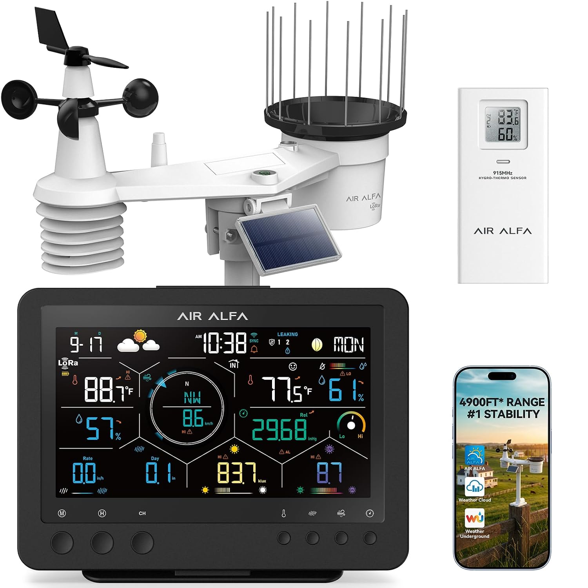

## Voice of the Customer Benchmarking Example

### Search #1

**Keywords:** "wireless outdoor weather station solar uv wind speed"

**Search Results Link:** [https://www.amazon.com/s?k=wireless+outdoor+weather+station+solar+uv+wind+speed](https://www.amazon.com/s?k=wireless+outdoor+weather+station+solar+uv+wind+speed)

### Selected Products

#### 1. [Ambient Weather WS-2000 WiFi Smart Weather Station](https://www.amazon.com/gp/aw/d/B07GRBY9NP)

* Price: $299.99
* Vendor: Amazon
* Description: All-in-one wireless outdoor sensor array measuring wind speed, wind direction, temperature, humidity, UV index, solar radiation, and rainfall, transmitting data to an indoor color LCD console.

##### Positive Comments

| Voice of the Customer | Restated Customer Need |
| :--- | :--- |
| "This is my second Ambient PWS. I received this as a Christmas gift. Easy to run through the instructions but the user should use the video based tutorial rather than the printed instructions. Accuracy seems perfect but I had to spend a bit of time calibrating the baramoter. I would recommend this model for any weather enthusiast." | 1. The device includes step-by-step setup documentation. (Explicit) 2. Setup materials utilize visual media to guide assembly and configuration. (Latent) 3. The system allows manual calibration offset adjustments for barometric pressure. (Explicit) |

##### Negative Comments

| Voice of the Customer | Restated Customer Need |
| :--- | :--- |
| "Product works fine, but do know it uses frequency 868 MHz, while all its accessories are on 915 MHz and are thus not usable. Better go for an Ecowitt Weather station." | 1. Wireless subsystems operate across matching regional frequency bands. (Explicit) 2. Main base stations maintain hardware compatibility with expansion accessories. (Explicit) 3. Wireless operating frequencies are clearly identified across system documentation and packaging. (Latent) |

---
#### 2. [4900FT WiFi Smart Weather Stations Wireless Indoor Outdoor, LoRa Based Wireless Weather Station with 7.4” HD Display, 7-in-1 Solar Sensor, Thermo-Hygro Sensor, Bird Spike](https://www.amazon.com/AIR-ALFA-Stations-Wireless-Thermo-Hygro/dp/B0GQZ68ZFC/)

* Price: $199.99
* Vendor: Amazon
* Description: An expandable outdoor environmental monitoring system featuring a 7-in-1 solar-powered sensor array and a 7.4-inch HD color display console. The outdoor unit tracks temperature, humidity, rainfall, wind speed, wind direction, UV, and light intensity, using long-range LoRa wireless technology to transmit telemetry up to 4,900 feet to the console. The system supports up to 14 multi-zone add-on sensors and offers 2.4 GHz Wi-Fi connectivity for mobile app alerting and CSV data export.

##### Positive Comments

| Voice of the Customer | Restated Customer Need |
| :--- | :--- |
| "Delivered quickly, set-up was a snap. Has great features and can add other sensors." | 1. The device requires minimal assembly and configuration to begin operating. (explicit) 2. The system allows users to connect auxiliary environmental sensors. (explicit)) 3. Out-of-box user onboarding is straightforward for non-technical users. (latent) |

##### Negative Comments

| Voice of the Customer | Restated Customer Need |
| :--- | :--- |
| "I had high hopes for this device, but unfortunately, it didn't hold up. Within a short period of use, the sensors began giving inconsistent readings, and it frequently lost connection with the base station. The overall build quality felt flimsy, and it ultimately didn't meet expectations. I wouldn't recommend this product." | 1. The sensors maintain consistent measurement accuracy over time. (explicit) 2. The wireless link maintains continuous connection with the base station. (explicit) 3. Internal components resist signal degradation and measurement drift during extended deployment. (latent) |

---
### Search #2

**Search Results Link:** <add your link here>

### Selected Products

#### 3. [Sainlogic Smart WiFi Weather Station with Rain Gauge and Wind Speed, 24/7 AI Weather Forecast by Weatherseed®, Wireless Indoor Outdoor, APP Alerts, 2-Year Data Export]([https://www.amazon.com/Raddy-UV7-Weather-Station-Black/dp/B0GLNZ66QZ/](https://www.amazon.com/Sainlogic-Weather-Forecast-Weatherseed%C2%AE-Wireless/dp/B0GXFC21DP/))
* Price: $169.99
* Vendor: Amazon
* Description: A Wi-Fi-enabled weather monitoring station featuring an integrated outdoor sensor array, high-contrast display console, and mobile app integration. The system tracks temperature, humidity, barometric pressure, and rainfall (accurate to ±1 mm) with a wireless range covering residential and agricultural properties. The base unit syncs with a mobile app via 2.4 GHz Wi-Fi to deliver AI-driven weather forecasting, real-time threshold alerts, and a 2-year data archive with Excel export capabilities.

##### Positive Comments

| Voice of the Customer | Restated Customer Need |
| :--- | :--- |
| "Seems like a good product for the price paid, so far. I like the easy setup and the color display. I've noticed that the indoor temperature kind of changes in big increments, one degree or more. I wonder about the accuracy of the temp measurement. Also the outside sensor displays what it seems a higher humidity than it feels. Also the change is in big increments, 5-9%. Will see if these changes stabilize more in time." | 1. The product offers competitive features relative to its cost. (explicit) 2. The system allows quick, straightforward initial hardware setup. (explicit) 3. The display unit utilizes a clear, color-coded visual interface. (explicit) |

##### Negative Comments

| Voice of the Customer | Restated Customer Need |
| :--- | :--- |
| "Easy set up and decent display. The Weatherseed app leaves a bit to be desired, as does the info it provides to Weather Underground I had a station from a different manufacturer at our prior home that sent the info from the barometer to WU. This Sainlogic unit does not. Had I known the two item mentioned above I would not have purchased this unit" | 1. he mobile application provides a robust and feature-rich user interface. (explicit) 2. The system transmits all local sensor parameters (including barometric pressure) to third-party weather services. (explicit) 3. Product documentation explicitly lists data field limitations for third-party integrations prior to purchase. (latent) |

---
#### 4. Next Product goes here

#### 5. Next Product goes here

## Organized Need Statements

### First Placement

### Grouped with categories

### Ranked

## Compiled list of user Needs

1. The device will...
1. The device is ...
1. The device can ...
100. The device is...
